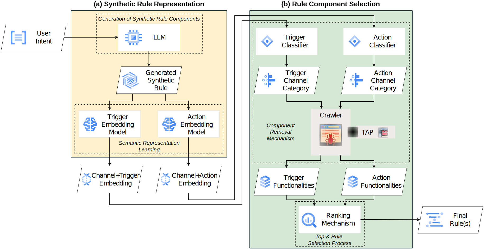

    

# IoT Rule Generation with Cross-View Contrastive Learning and Perplexity-Based Ranking

This repository contains the supplementary material for the paper "IoT Rule Generation with Cross-View Contrastive Learning and Perplexity-Based Ranking"

This material comprises the source codes useful for the repeatability of the experiments.
# Creators
Mattia Limone (mattia.limone@mail.com), Gaetano Cimino (gcimino@unisa.it) and Vincenzo Deufemia (deufemia@unisa.it)

# Overview
In this paper presents TARGE (Trigger-Action Rule GEneration), a novel framework for generating IoT automation rules 
directly from natural language user intents. TARGE leverages Large Language Models (LLMs) to interpret user intents and employs cross-view contrastive learning to generate rule embeddings that capture TAP functionality and device relationships. Its ranking mechanism combines semantic consistency with LLM-derived perplexity to prioritize contextually coherent rules.

# TARGE Architecture

    

# Setting Environment
We provide  a requirements.txt file to install the necessary packages. You can install the required packages by running `pip install -r requirements.txt`.

# Preprocessing
To generate the dataset, run `python src/preprocessing/build_dataset.py`.
The script will generate the dataset from the IFTTT.
The generated dataset will be saved in the `data/dataset` directory.

To build the dataset to train an embedder, run `python src/preprocessing/build_embedder_dataset.py`.

# Training
To train the classifier, run `python src/train/train_classifier.py`.

To train the Large Language Model, run `python src/train/train_llm.py`. args are provided in the script to specify the scope of the training (recipe, action, trigger) and the set (clear, unclear)

To train the Embedder, run `python src/train/train_embedder.py`.

# Evaluation
The evaluation scripts are in the `src/evaluate` directory. 
First generate all the rules from the trained language models by running `python src/evaluate/generate.py`. 
Then evaluate the generated rules using the following notebook.

- `src/evaluate/evaluate_final.ipynb` is the notebook to evaluate the generated rules on CRG and ICG mode on GOLD and NOISY test set
- `src/evaluate/evaluate_final_one_shot.ipynb` is the notebook to evaluate the generated rules on CRG and ICG mode  on one-shot test set
- `src/evaluate/evaluate_final_fasttext.ipynb` is the notebook to evaluate the generated rules with FastText embeddings
- `src/evaluate/evaluate_final_word2vec.ipynb` is the notebook to evaluate the generated rules with word2vec embeddings

